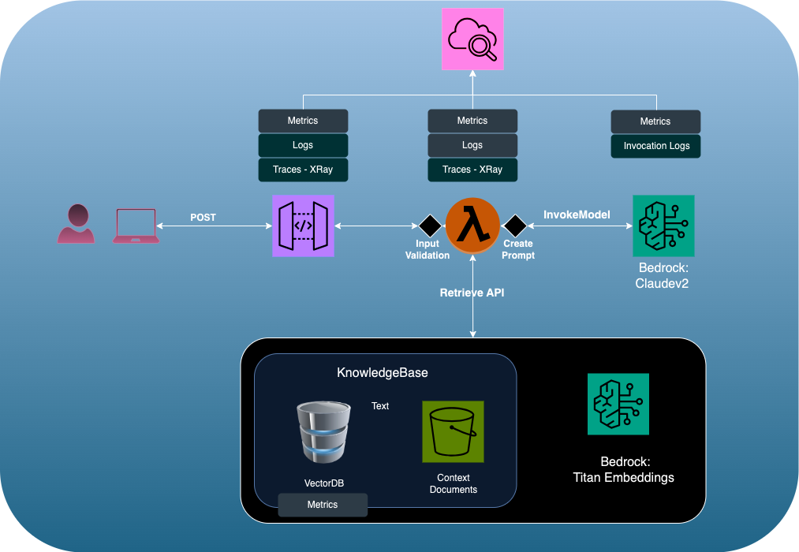

# Pet Recommendation Assistant

This samples application recommends pets suitable to our users bases on their personal circumstances from the all the pets currently available in our Pet Adoption Store.

File Structure:
1. index.html : User Interface to get user inputs and provide recommendations
2. lambda_function.py: Backend that takes user input + Knowledge Base context + instructions to call Bedrock invoke API. It responds with the final recommendation to be served to the user.
3. PetDescriptions.txt : List of pets available for adoption which makes up the Knowledge base data.
4. PetRecommeder_1.png : Architectural diagram of the app.

